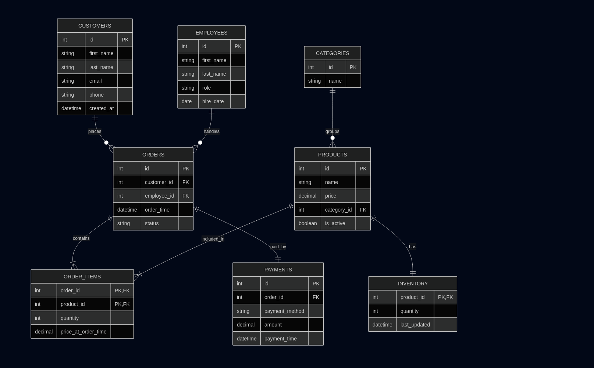

# Design Document

## Scope

### What is the purpose of your database?

The purpose of this database is to support the core operational needs of a small coffee shop. It is designed to store and manage information related to customers, employees, products, orders, payments, and inventory. The database enables the coffee shop to track sales, manage stock levels, and maintain basic customer and employee records in a structured and consistent way.

---

### Which people, places, things, etc. are you including in the scope of your database?

The database includes the following entities within its scope:

- Customers, representing registered customers of the coffee shop
- Employees, representing staff members who handle orders
- Products, representing items sold by the coffee shop (e.g., coffee, pastries)
- Product categories, used to group products logically
- Orders, representing purchases made at the coffee shop
- Order items, representing individual products within an order
- Payments, representing how orders are paid for
- Inventory, representing stock levels for products

The database models the relationships between these entities, such as customers placing orders, employees handling orders, and products being included in multiple orders.

---

### Which people, places, things, etc. are outside the scope of your database?

The database intentionally excludes several features to keep the design focused and manageable:

- Online ordering and delivery systems
- User authentication, passwords, or account security
- Real-time payment processing or integration with payment providers
- Supplier and vendor management
- Tax, discount, or complex pricing rules
- Detailed employee scheduling or payroll systems

These features are considered outside the scope of this project.

---

## Functional Requirements

### What should a user be able to do with your database?

A user of this database should be able to:

- Store and manage information about products and their categories
- Track inventory quantities for each product
- Record customer orders, including walk-in customers
- Associate orders with employees who handled them
- Store detailed order contents, including quantities and prices at the time of order
- Record payments made for orders
- Retrieve information such as order history, total sales, and inventory levels

These operations are supported through standard SQL queries such as `SELECT`, `INSERT`, `UPDATE`, and `DELETE`.

---

### What's beyond the scope of what a user should be able to do with your database?

Users should not expect the database to:

- Automatically process or validate payments
- Enforce business rules such as tax calculations or promotions
- Handle customer authentication or authorization
- Support real-time analytics or concurrent transaction handling
- Automatically reorder inventory or manage suppliers

Such functionality would typically be handled by application logic or external systems.

---

## Representation

### Entities

#### Which entities will you choose to represent in your database?

The database represents the following entities:

- `customers`
- `employees`
- `categories`
- `products`
- `inventory`
- `orders`
- `order_items`
- `payments`

Each entity corresponds to a real-world concept within a coffee shop and is represented as a separate table.

---

#### What attributes will those entities have?

Each entity includes attributes appropriate to its role, such as:

- Identifiers (`id`) to uniquely identify records
- Descriptive fields (e.g., names, roles, categories)
- Numerical values (e.g., prices, quantities)
- Timestamps (e.g., order time, payment time)

For example, the `orders` table includes attributes for the order time, associated employee, optional customer, and order status, while the `order_items` table includes quantity and price at the time of ordering.

---

#### Why did you choose the types you did?

Data types were chosen to reflect the nature of the stored data:

- Integer types are used for primary and foreign keys
- Text types are used for names, roles, and statuses
- Decimal or numeric types are used for prices and monetary values to avoid rounding issues
- Date and datetime types are used to track temporal events such as orders and payments

These choices ensure accuracy, readability, and efficient storage.

---

#### Why did you choose the constraints you did?

Constraints were chosen to enforce data integrity:

- Primary keys uniquely identify each record
- Foreign keys enforce valid relationships between tables
- UNIQUE constraints prevent duplicate values where appropriate (e.g., category names)
- NOT NULL constraints ensure required data is always present
- Nullable foreign keys (such as `customer_id` in `orders`) allow for walk-in customers

These constraints reflect real-world rules while maintaining flexibility.

---

### Relationships

The database contains several one-to-many and many-to-many relationships:

- A customer may place many orders, but an order may optionally belong to a customer
- An employee may handle many orders
- An order contains many products, and a product may appear in many orders (resolved using `order_items`)
- A category contains many products
- Each product has exactly one inventory record
- Each order has exactly one payment record

An entity relationship diagram is included below to visually represent these relationships.

---

## Optimizations

To improve performance and usability, the database includes several optimizations:

- Indexes on foreign key columns to speed up joins between tables
- Indexes on commonly queried fields such as order timestamps
- A junction table (`order_items`) to efficiently model many-to-many relationships
- Optional views to simplify common queries such as order summaries or daily sales reports

These optimizations help ensure that the database remains efficient as the amount of data grows.

---

## Limitations

### What are the limitations of your design?

This database is designed for simplicity and clarity rather than full-scale production use. It assumes a single coffee shop location and does not account for multiple branches. Inventory tracking is simplified and does not include supplier information or restocking logic.

---

### What might your database not be able to represent very well?

The database does not handle:

- Complex pricing changes over time
- Partial payments or refunds
- Advanced customer loyalty systems
- Concurrent order processing at scale
- Legal or financial reporting requirements

These limitations are acceptable given the educational purpose and intended scope of the project.
